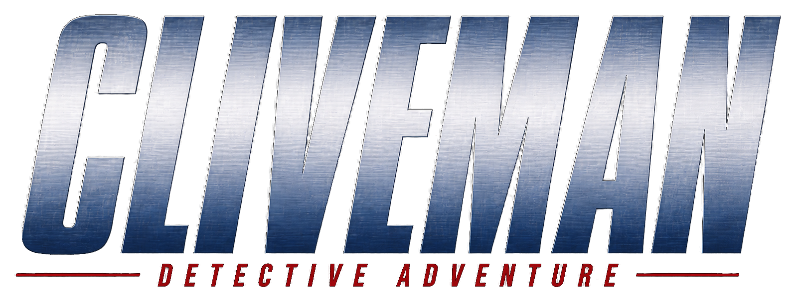

<p align="center">
  
</p>

# Cliveman 2.0.20 — Developer Source

Cliveman is a browser-based detective adventure with a green CRT-terminal presentation, motion-comic story scenes, first-person NAV exploration, city driving with a minimap/GPS route, dialogue and interrogations, scripted sequences, and validated local save files.

This repository contains the editable developer build. The game runs entirely in the browser: open `index.html`, or [play the GitHub Pages build](https://premohq.github.io/Cliveman/). No account, server, or runtime API key is required.

## What is included in 2.0.20

- The Mayo Corp factory is one persistent, physically traversable NAV world. Five original room layouts are stacked at different elevations and connected by short east hallways to a continuous stair tower on the right side of the building.
- Factory movement does not load another floor, invoke a transition callback, or teleport the player to a spawn point.
- Factory regression tests protect the original room coordinates, props, evidence, events, roof exit, bidirectional reachability, stair rise, deck height, and camera headroom.
- NAV evidence uses lightweight procedural low-poly Three.js meshes, with the existing pixel-art cross-plane renderer retained as a fallback for unknown item keys.
- The approved transparent title artwork at `assets/cliveman-logo.png` is used both in-game and at the top of this README.
- Motion-comic interrogation assets include cropped Clemons neutral, shocked, confident, defensive, smug, and cornered reactions.
- Earlier 2.0.x work remains included: city-bound objective placement, depth-enhanced driving minimap, global pause/save consistency, multilingual dialogue, consolidated maintainable modules, compressed scene art, and the older/heavier-but-capable Cliveman art direction.

## Run the game

Open `index.html` directly in a modern desktop or mobile browser. A local server is optional:

```bash
python3 -m http.server 8000
```

Then visit `http://localhost:8000`.

## Validate the developer build

```bash
npm install
npm test
```

`npm test` runs the dependency-free, jsdom, presentation, save/load, city-drive, package-integrity, and factory-navigation suites. Browser-only performance checks are available through `npm run test:browser` after Playwright Chromium is installed. Pixel comparison requires a reference checkout; see `tests/README.md`.

## Project layout

| Path | Purpose |
| --- | --- |
| `index.html` | Browser entry point and responsive terminal UI/CSS |
| `engine/` | Runtime, NAV, raycaster, audio, UI, saves, art, localization |
| `story/` | Title sequence, chapters, finale, story minigames |
| `minigame/` | Editable city-driving source, prebuilt bundle, vendored Three.js/Draco |
| `assets/` | Approved title logo, scene art, interrogation panels, audio |
| `tests/` | Automated regression and browser validation |
| `scripts/` | Maintenance utilities such as offline voice generation |
| `docs/` | Full historical handoff, validation notes, and Claude import guide |

## Factory navigation contract

The required route is room → short hallway → physical stair tower → next floor. Do not restore teleport stairs, per-floor room swaps, deep vertical shafts, or long flattened corridors. If the NAV implementation changes, preserve story flags, evidence/event coordinates, saves, the roof exit, and every factory test.

## Claude handoff

Import the repository or the companion export ZIP and begin with [`docs/CLAUDE_IMPORT.md`](docs/CLAUDE_IMPORT.md). It identifies the authoritative files, latest additions, protected requirements, validation commands, and safe continuation order.

## Provenance

The recovered developer archive used for this update has SHA-256:

```text
05a77960cf27166bd6093b5999761f630d5fbcf012a0c5ae9d11a5282123d094
```
